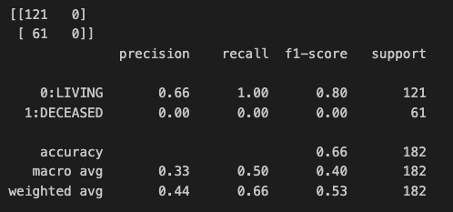
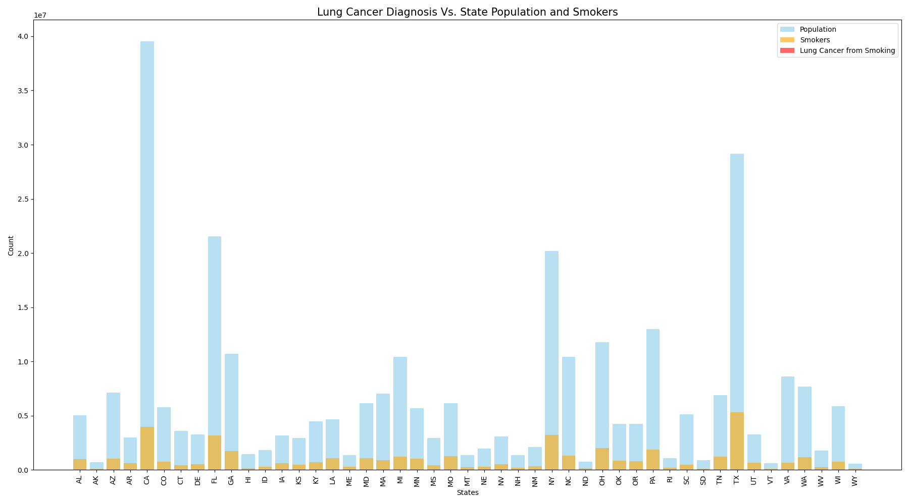

# Exploring Early Detection Methods for Non-Small Cell Lung Cancer Using Machine Learning Models

**Authors:** Nefertiti Muhammad, Adrian De La Cruz, Joe Coffaro, Alexander Walden

  
*Figure 1: Lung cancer incidence in the U.S. Data source: The NCI Cancer Atlas (2017 - 2021). [NCI Cancer Atlas](https://gis.cancer.gov/canceratlas/tableview/?d=1&a=1&r=1&s=33)*

## Overview

Together, small cell lung cancer (SCLC) and non-small cell lung cancer (NSCLC) are the second most common cancers in the United States. Approximately 10% to 15% of all lung cancers are SCLC, while NSCLC accounts for about 80% to 85%. Lung cancer is the leading cause of cancer-related deaths in the U.S., often diagnosed at later stages, which complicates treatment and negatively impacts survival rates. Research into early detection methods is crucial for improving patient outcomes.

In this project, we developed neural network and regression models to predict survival outcomes for NSCLC patients. Our goal is to utilize machine learning to identify factors that can aid in early detection.

  
*Figure 2: Early Diagnosis May Predict Cancer Survival*

## Dataset & Tableau Dashboard Links

The dataset utilized for this project is sourced from the paper "Distinct patterns of somatic genome alterations in lung adenocarcinomas and squamous cell carcinomas" (Nat Genet. 2016 Jun;48(6):607-16. doi: 10.1038/ng.3564). It was downloaded from cBioPortal:

[NSCLC TCGA Broad 2016 Dataset](https://www.cbioportal.org/study/clinicalData?id=nsclc_tcga_broad_2016)

This dataset includes demographic, lifestyle, and genomic data, allowing us to analyze differences among patients and build predictive models.

The NCI Cancer Atlas was also used to gather data on lung cancer incidence in th U.S. by State (2017 - 2021)
https://gis.cancer.gov/canceratlas/tableview/?d=1&a=1&r=1&s=33

Tableau Dashboard: [Lung Cancer Incidence in the U.S.](https://public.tableau.com/app/profile/nefertiti.muhammad/viz/LungCancerIncidenceintheU_S_/Dashboard1?publish=yes) & [Project 4 NSCLC Survival Predictors](https://public.tableau.com/app/profile/nefertiti.muhammad/viz/Project4NSCLCSurvivalPredictors/HistoryofMalignancyDecreasesSurvival?publish=yes)

## Methodology

1. **Data Preprocessing**
   - Cleaning and preparing the dataset for analysis.
   - Handling missing values and normalizing data.

2. **Model Development**
   - Implementing neural network models for predictive analysis.
   - Utilizing regression techniques to evaluate survival outcomes.

3. **Evaluation Metrics**
   - Assessing model performance using metrics such as accuracy, precision, recall, and F1-score.

## Results

### Regression Model

The Logistic Regression model was built upon the lung cancer data set in order to predict the 'Overall Survival Status' results.  Factors in the dataset was cleaned for any float value columns for any null values and any columns with binary string outputs were replaced with 1s & 0s, accordingly.

In using the solver method of LBFGS and setting the maximum number of iterations to 1,200, the model results were as follows:

The logistic regression model provides for a fair means of predicting the values for the surviving population (i.e. class labeled as '0') as the precision shown is reported at 0.66, showing that the model predicted positively approximately 2 out of 3 assessments.  The recall reported for the prediction of surviving population is 1.00, which shows that the prediction for the Living Survival was correct at predicting an actual survivor 100% of the time.

As for the model's ability to predict the values for the non-surviving population (i.e. class labeled as '1'), the model did not perform well at all, as the precision and the recall is reported at 0%.

As the results for the model were lower than desired, several runs of the model were performed to only use one factor at a time.  With several iterations, the analysis provided that the two factors of 1) Smoking History and 2) Prior Cancer Diagnosis Occurence allowed for a higher precision result of 0.74 for the survival prediction, although no benefits were observed for the non-survival prediction.

Overall, the model performed fairly for predicting survivors, although the model would most likely perform better with a significantly larger dataset than the one we sourced (i.e. a dataset with significantly more than 1200 patients).

### Neural Network Model

Used scikitlearn and keras libraries alongside Pandas to find and create the best neural network structure for a machine learning model to predict the target variable in our dataset. The factors of our dataset would be used by the model to predict whether a patient survived after their diagnosis of lung cancer.
Steps included:
* Data preparation: ~200 rows dropped and target separated into 0s and 1s; dropped unknown columns
* Training/splitting: Split into testing and training data based on X (nine features chosen from the raw dataset) and y (survival status, or whether patient survived following diagnosis)
* Used StandardScaler instance to scale data
* Used keras tuner to find optimized combination of hyperparameters
* Creating model architecture: first layer, three dense layers, and output layer consisting of 9, 3, 5, 3, 9, and 3 units respectively

The best our optimized model as per keras could achieve in accuracy was 73%, indicating our dataset should perhaps be reevaluated in terms of scope and number of samples if we are to construct a more accurate, robust model.

### Random Forest Decision Model

A random forest classifier is an ensemble learning method used for classification tasks. It builds multiple decision trees during training and merges their predictions to improve accuracy and control overfitting. We thought it could provide predictive power for our dataset. It turned out to be slightly more effective than our other models, showing that it may have been best suited. Its results showed that it had a 77% prediction rate for survival, 94% recall score, and 85% f1 score. Its overall accuracy was evaluated at 76%. 

## Factors Influencing Survival Prediction

The analysis highlights two significant factors that contribute to a higher precision result of 0.74 for the regreeion survival prediction:

1. **Smoking History**
2. **Prior Cancer Diagnosis Occurrence**

.png)  
*Figure 5: History of malignancy decreases survival. This figure illustrates how prior cancer diagnoses improve the predictive model, as supported by ANOVA results.*

Interestingly, the analysis did not reveal a significant difference in survival outcomes based on smoking history by way of an ANOVA test. This finding is counterintuitive, given the established link between smoking and cancer severity and points to limitations of the dataset.

  
*Figure 6: Analysis of sex and smoking history in relation to survival outcomes.*

The analysis did not show a significant difference in survival outcomes based on other factors such as sex and NSCLC subtypes. However, there is a trend indicating that squamous carcinoma is more deadly, which aligns with existing research. The lack of significance in this dataset highlights potential limitations and variability within the data.

  
*Figure 7: Comparison of death rates between squamous carcinoma and adenocarcinoma.*

*Figure 8: Lung cancer diagnosis vs. state population and smokers.

## Limitations

The bar graph above is displaying lung cancer diagnosis due to smoking by the populaiton of each state. The Y-axis is population by the millions and the X-axis represents the state and number of smokers in that state. As we can see in the graph based on the legend there is no red meaning we can not see the number of lung cancer diagnosis due to smoking. The reason for this is because lung cancer diagnosis specifically related to smoking is such a small number of cases compared to the total population of a state that trying to capture this data was not a proper way of doing so. A better, more effective way of seeing lung cancer diagnosis due to smoking would be to break down the population sample. Look into smaller sample sizes such as regions or cities. *

## Conclusion
In this repository, we’ve explored the foundational concepts and practical applications of machine learning. We produced several models, fitted them from our data, and evaluated their accuracy. The results were various, and revealed much about our approach and the effectiveness of the models. We attempted to implement several models in order to compare them. The accuracy can doubtlessly be improved, but we need further insight into this topic. Our results showed our factors did not influence survival as much as we thought, so we should reevaluate our methodology according to what we learned in this project. Several strategies might remedy these problems, including gathering larger amounts of data, further tuning, using other algorithms, and adding more features to increase performance. There is reason for confidence that these steps would help us in the future, in the process allowing those of us who worked on this project the chance to further hone our skills.

## Acknowledgments

Inspiration and credit for any code used is from work done during attendance in the 2024 Northwestern University Data Analysis Bootcamp class sessions.

Thank you to the organizations from whom we retrieved the data used in the completion of this project.
